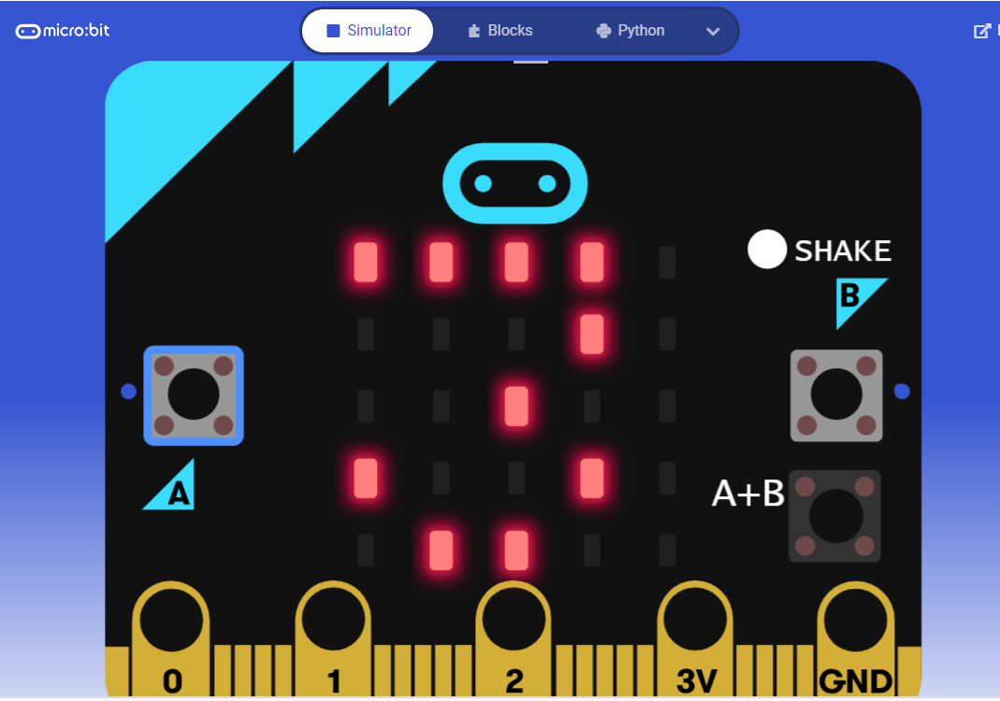

# Microbit Arithmetic Calculator
This program makes the microbit a full-functioning arithmetic calculator.
This calculator supports addition, subtraction, multiplication, division and exponents.

If you don't have a microbit to try the code out, this page will contain a microbit simulator: https://makecode.microbit.org/_9Uz6RJELsXi5

## How to use
- Press Button A to increment first number by one
- Press Button B to increment second number by one
- Click the shake button to change operation (it is at addition at default, so one shake is subtraction, two is multiplication, three is division, four is exponents, five is addition, and so on...)
- Press both Buttons A and B to find and see the result.
- The selected operation will be applied on the chosen first and second numbers, and the result value of this operation will be displayed on the screen.
 

 
Don't forget to leave a ⭐! Thank you!
